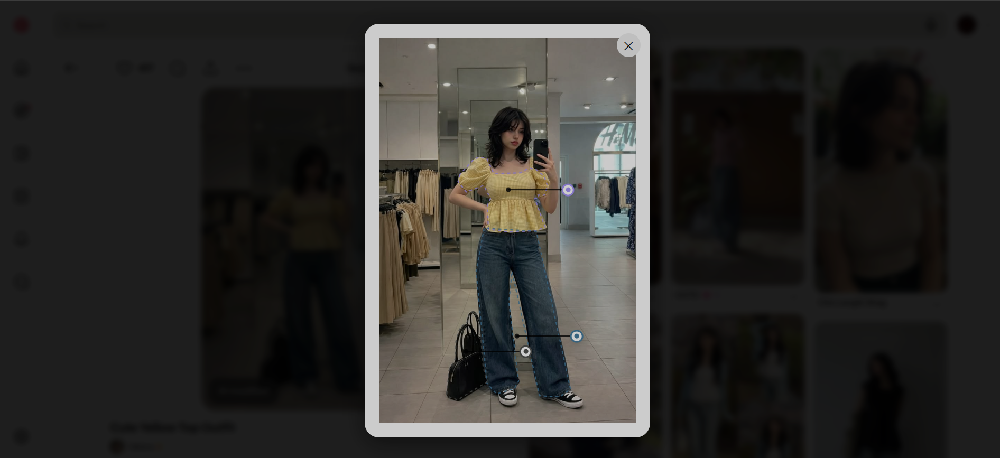
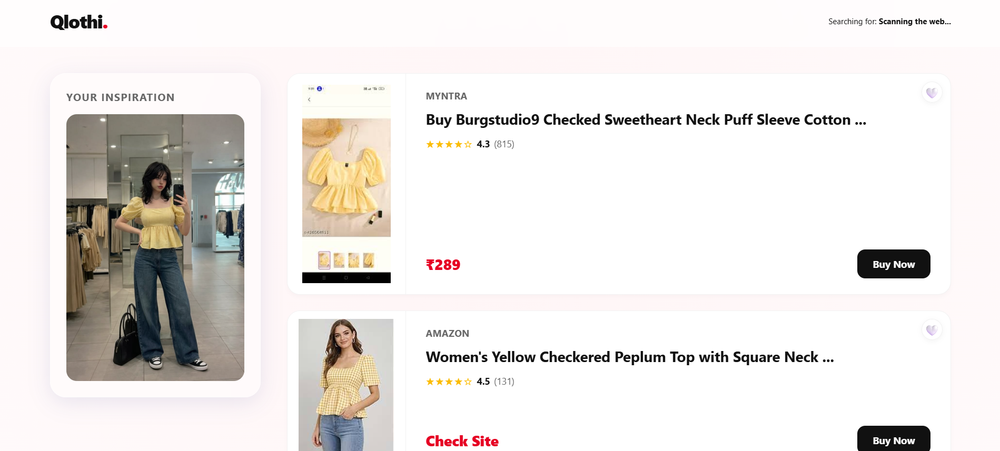

# Qlothi: The AI-Powered Fashion Hub 👗✨

**Qlothi** is a high-end, intelligent Chrome extension designed to revolutionize how enthusiasts find and curate fashion. By combining advanced **Computer Vision**, **Vision-Language Models (VLM)**, and **Localized Browser Scraping**, Qlothi transforms any static image on Pinterest into a clickable, shoppable storefront focused on the Indian market.

---

## 🚀 What We Built

Qlothi is more than just a search tool; it is a full-fledged fashion curation ecosystem consisting of three core pillars:

1.  **AI Image Segmentation**: Utilizing the `Segformer` B2 transformer model, Qlothi "looks" at an image and instantly identifies individual items—from hats and sunglasses to dresses and shoes—providing interactive shopping "dots" for each.
2.  **Multimodal AI Search**: We integrated `Salesforce/BLIP` (a Vision-Language Model) to generate semantic text descriptions of garments. If you click a blue dress, the AI secretly writes *"A navy blue ribbed knit midi dress"* to supplement the visual search, resulting in pinpoint accuracy.
3.  **The Virtual Wardrobe**: A persistent "Wishlist" system. Users can save outfits they love into a local database and access them anytime through a sleek, glassmorphism-inspired toolbar popup.

---

## 🛠️ The Tech Stack (How We Built It)

### **The Backend (FastAPI + Transformers)**
*   **Intelligence**: A Python FastAPI server hosting two massive AI models:
    *   `mattmdjaga/segformer_b2_clothes` for surgical precision segmentation.
    *   `Salesforce/blip-image-captioning-base` for semantic multimodal searching.
*   **Deployment**: Optimized for Hugging Face Spaces using a Custom Docker volume to manage the 2GB+ AI weights.

### **The Frontend (Chrome Extension V3)**
*   **Design**: A premium "Glassmorphism" UI built with Vanilla CSS, focused on transparency, blur effects, and smooth micro-animations.
*   **Active Polling Engine**: A custom-built JavaScript engine in the background service worker that manages invisible browser tabs, performing active DOM polling every 100ms to extract real-time data from Google Lens.

---

## 🛡️ Challenges Faced (The Engineering Journey)

Building Qlothi wasn't easy. We faced several major technical hurdles that required creative architectural pivots:

### **1. The API Barrier (Pivot from Bing)**
Originally, we intended to use the Bing Visual Search API. However, we quickly realized that for a free, community-driven tool, expensive API keys were a dealbreaker. 
*   **Solution**: We pivoted to an "In-Browser Scraper." We engineered the extension to "pretend" to be a user, uploading images to Google Lens in a hidden tab and extracting data directly from the DOM, making the tool **100% free forever.**

### **2. The Google Lens "React" Mystery**
Google Lens uses a complex, obfuscated React DOM. Simply searching for an `` tag wasn't enough, as the data loads dynamically and images often don't have standard URLs.
*   **Solution**: We implemented a **Recursive Image Finder** that analyzes parent containers and extracts high-resolution thumbnails, upscaling them via Regex (`=w800-h1000`) before they ever reach the user's screen.

### **3. The Localization Struggle**
Global search engines often suggest stores that don't ship to India (like Target or Walmart US).
*   **Solution**: We hard-coded a geographic localization layer that forces the search through `google.co.in` and explicitly filters out non-shipping international domains and foreign currencies ($/€/£).

---

## 🔮 Future Aspects (The Roadmap)

While Qlothi is production-ready, there are several exciting directions for future expansion:

- **Universal Search (Right-Click Anyone)**: Expanding the extension to work on any website (Instagram, Blogs, News) via a context menu right-click.
- **Affiliate Integration**: Monetizing the extension by injecting affiliate tags into "Buy Now" links from Myntra, Amazon, and Ajio.
- **AI Stylist ("Complete the Look")**: Using the VLM to suggest matching accessories (shoes, bags) for any item saved in the Virtual Wardrobe.
- **Price Drop Alerts**: Periodically checking the user's saved items and sending a browser notification if a saved dress goes on sale.

---

## 📦 Installation & Setup

### **1. Extension Setup**
1. Download this repository and unzip it.
2. Go to `chrome://extensions/` in your browser.
3. Enable **Developer Mode**.
4. Click **Load Unpacked** and select the `/extension` folder.

### **2. Backend Setup**
The backend is currently hosted and running on Hugging Face. If you wish to run it locally:
1. `cd backend`
2. `pip install -r requirements.txt`
3. `python main.py` (Ensure you update the `background.js` URL to `localhost`).

---

Made with ❤️ by **Komal** for the fashion-forward.
